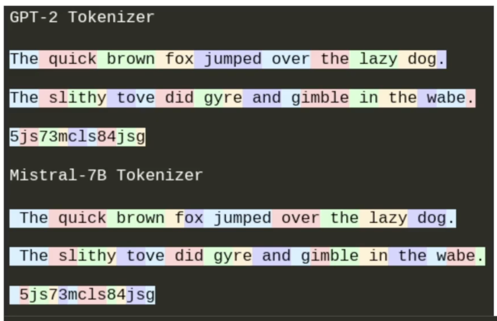

# Transformers from Scratch

- Transformers are the basic architectures that LLms are made of.
- The input to the transformers are sequences of tokens (words)
- The output of a model is the probability ditribution over the next token - ie: P(next_word = 'cat') = 0.90, P(next_word = 'hat') = 0.5 and so on.

- GPT2-small
  - Model size = 117M params
  - Data size = 40B tokens

- Text is tokenized by the tokenizer - note that each tokenizer has a different ways of splitting the characters - for example GPT-2 tokenizer would split the word 'fox' as fox but a Mistral Tokenizer woudl tokenize it as 'f' and 'ox'.

- Therefore, the choice of tokenizer is crucial to LLM performance as well, as the probability distribution generated by the LLM is based on the what it learns which is heavily dependent on what is being fed into the model as an input.

- Test is tokenized into sequence tokens (converted into numbers) -> fed into the model -> the model generated given the previous tokens how likely is 'Cat' (for eg) going to occur?

- RNNs can't be run/trained in parallel like Transformers

testt
